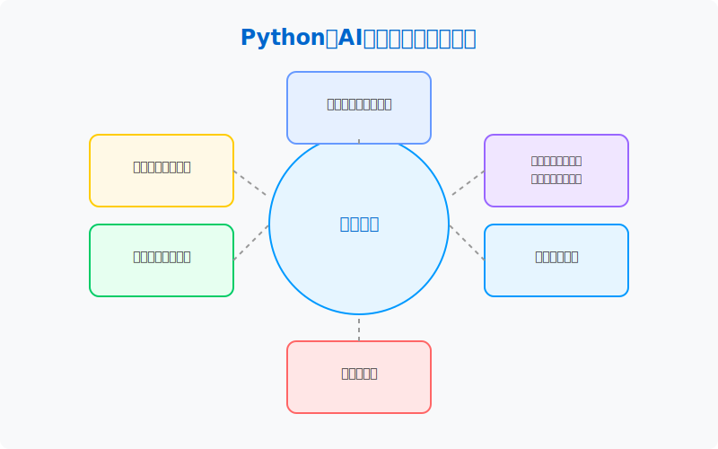

# Python与AI驱动的现代商务智能课程课件

本仓库包含《Python与AI驱动的现代商务智能》课程的完整课件，使用Quarto Book格式构建。

## 课件概述

这套课件涵盖了从数据采集、数据探索与可视化、计量经济学与机器学习、深度学习到大模型应用的完整内容，旨在帮助经济管理类研究生掌握现代商务智能的工具与方法。



## 使用方法

### 在线浏览

您可以通过以下链接直接访问在线版本的课件：

[课件在线地址](#) (发布后添加链接)

### 本地构建

如果您希望在本地构建和修改课件，请按照以下步骤操作：

1. **安装Quarto**

   请访问[Quarto官网](https://quarto.org/docs/get-started/)下载并安装Quarto。

2. **克隆仓库**

   ```bash
   git clone https://github.com/用户名/python-ai-bi.git
   cd python-ai-bi
   ```

3. **本地预览**

   ```bash
   quarto preview
   ```

   这将启动一个本地服务器，您可以在浏览器中实时预览课件。

4. **构建静态网站**

   ```bash
   quarto render
   ```

   这将在`_book`目录下生成静态网站文件。

5. **构建PDF版本** (可选)

   ```bash
   quarto render --to pdf
   ```

   注意：生成PDF需要安装LaTeX环境。

## 课件特色

### 可视化图表

本课件使用SVG矢量图形增强了内容可视性：

- **课程概览图**：直观展示课程各模块之间的关系
- **课程模块结构图**：展示六大模块的详细内容和学习路径
- **数据源多样性图**：展示不同类型的数据源及其特点
- **数据科学工作流程图**：展示数据科学项目的完整工作流程
- **大语言模型应用场景图**：展示LLM在商业中的应用领域

### 应用示例与实践

各模块均包含完整的代码示例和实践项目，支持学习者直接运行和调试。

## 课件结构

课件按照六个核心模块组织：

1. 数据采集与预处理
2. 数据探索与可视化
3. 计量经济学模型与传统机器学习融合应用
4. 简单深度学习入门与实践
5. 大模型API调用与智能应用
6. 项目部署与工程实践（可选）

每个模块包含理论讲解、代码示例和实践项目。

## 定制与扩展

您可以根据需要修改或扩展课件内容：

1. 编辑`.qmd`文件修改内容
2. 调整`_quarto.yml`文件修改配置
3. 更新`styles.css`文件自定义样式

## 贡献

欢迎通过以下方式贡献：

- 提交Issue报告问题或建议
- 创建Pull Request贡献内容改进
- 分享您基于本课件的教学经验

## 许可

本课件采用[CC BY-NC-SA 4.0](https://creativecommons.org/licenses/by-nc-sa/4.0/)许可协议。

## 联系方式

如有问题或建议，请联系：

- 邮箱：example@example.com
- 项目主页：https://github.com/用户名/python-ai-bi 